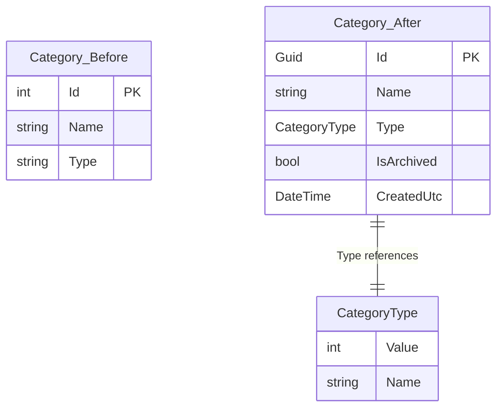
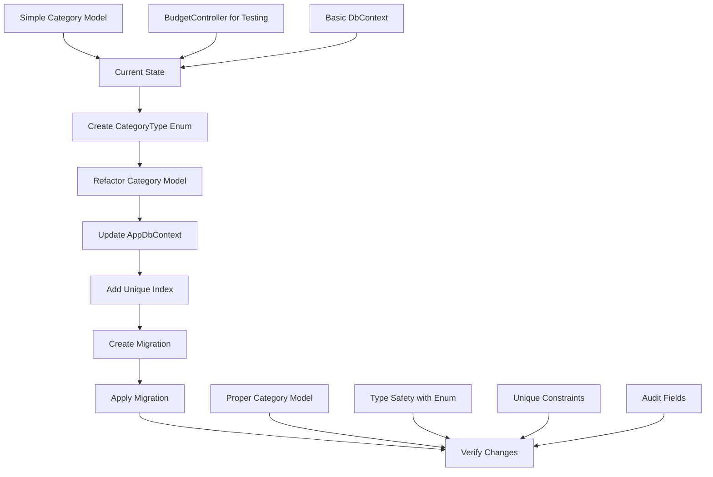
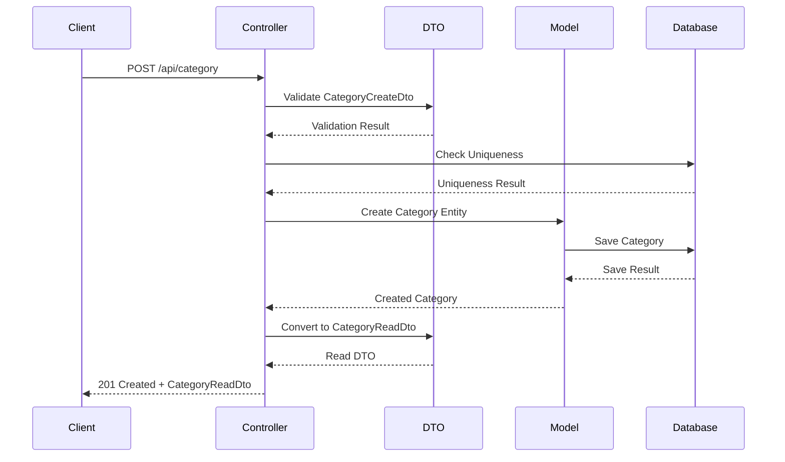
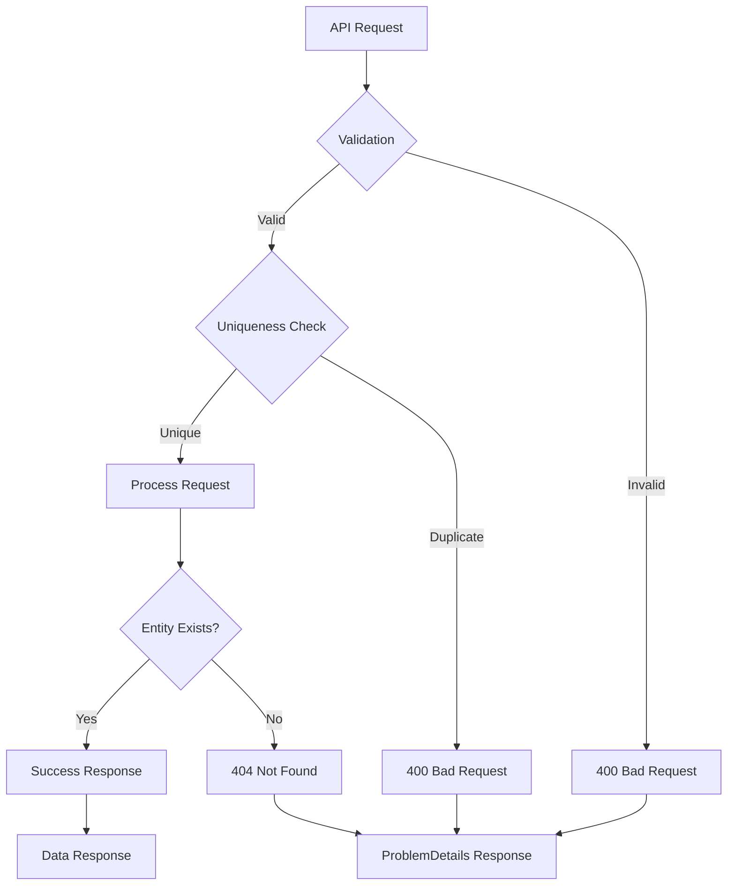

# S1.1 - Refactoring Diagram

## Database Schema Evolution



## Refactoring Flow



## Controller Refactoring (S1.2)

```mermaid
flowchart LR
    A[BudgetController] --> B[Delete BudgetController]
    B --> C[Create CategoryController]
    C --> D[Implement CRUD Operations]
    
    D --> E[POST /api/category]
    D --> F[GET /api/category]
    D --> G[PUT /api/category/{id}]
    D --> H[DELETE /api/category/{id}]
    
    E --> I[Create Category]
    F --> J[List Categories]
    G --> K[Update Category]
    H --> L[Soft Delete Category]
```

## API Endpoint Structure

```mermaid
graph TD
    A[CategoryController] --> B[POST /api/category]
    A --> C[GET /api/category]
    A --> D[GET /api/category/{id}]
    A --> E[PUT /api/category/{id}]
    A --> F[DELETE /api/category/{id}]
    
    B --> B1[Create Category]
    B --> B2[Validation]
    B --> B3[Unique Check]
    
    C --> C1[List Categories]
    C --> C2[Filter by Type]
    C --> C3[Include Archived]
    
    D --> D1[Get Single Category]
    D --> D2[404 if Not Found]
    
    E --> E1[Update Category]
    E --> E2[Validation]
    E --> E3[Unique Check]
    
    F --> F1[Soft Delete]
    F --> F2[Set IsArchived = true]
```

## Data Flow



## Error Handling Flow


